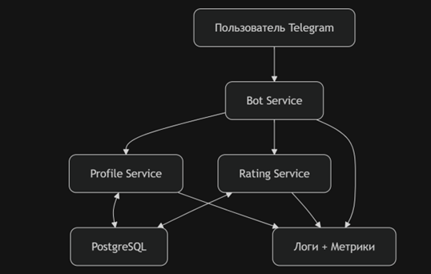

# Архитектура 

1. **Пользователь отправляет сообщение в Telegram**
- оно попадает в Telegram Bot API (внешний сервис Telegram)

2. **Bot Service (на aiogram) — главный обработчик:**
- понимает команды (/start, лайк, пропустить, редактировать профиль и т.д.)
- отвечает пользователю прямо в чат
- передаёт нужные задачи двум другим сервисам

3. **Profile Service отвечает за анкеты:**
- создание / просмотр / редактирование анкеты
- хранение био, интересов, фотографий
- расчёт первичного рейтинга (уровень 1):
- насколько анкета заполнена, сколько фото, возраст, город и т.д.

4. **Rating Service занимается рейтингом:**
- считает все три уровня из ТЗ:
- Уровень 1 — первичный (по анкете)
- Уровень 2 — поведенческий (пока заглушка)
- Уровень 3 — комбинированный (взвешенная сумма)

- хранит рейтинги в отдельной таблице → удобно пересчитывать позже (Celery)

**PostgreSQL — одна общая база данных для Profile и Rating сервисов**
- Логи и метрики (дополнительный балл):
- Все три сервиса пишут структурированные логи (structlog)
- Считают метрики: сколько сообщений обработано, сколько ошибок, время расчёта рейтинга и т.д. (prometheus-client)

